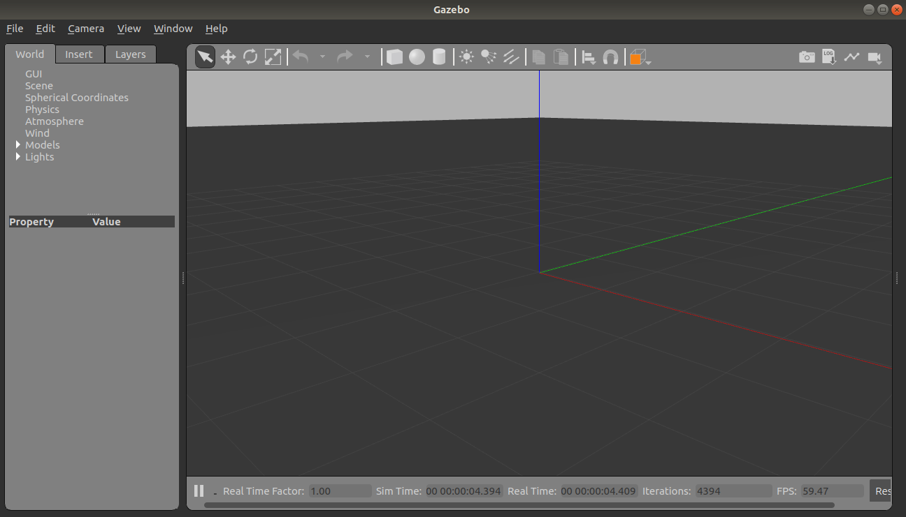

# Install Gazebo

We are using Gazebo 9 which is used with ROS melodic and PX4. For installation steps see [PX4](../PX4/Install.md) script which installs Gazebo in addition other software packages or in [Gazebo Websie](http://gazebosim.org/tutorials?cat=install&tut=install_ubuntu&ver=9.0).

To check if it is installed correctly run `gazebo` command in terminal and it will open gazebo simulator.

