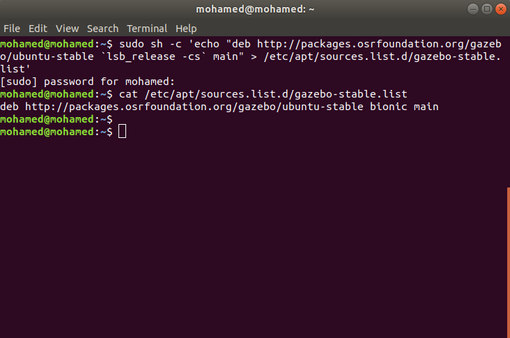
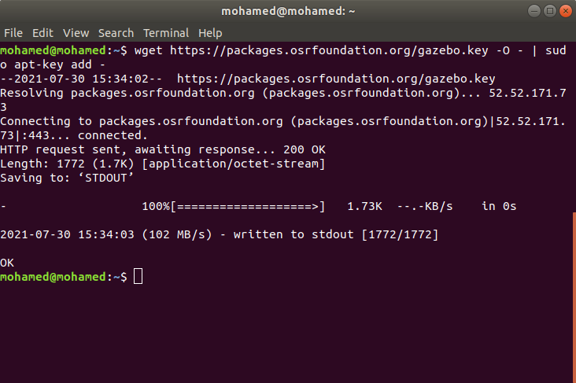
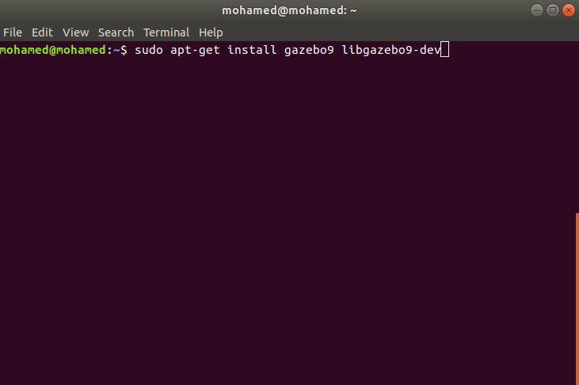
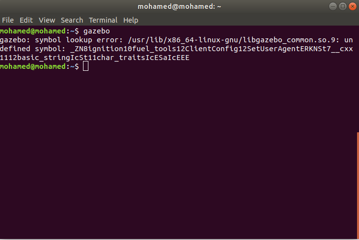
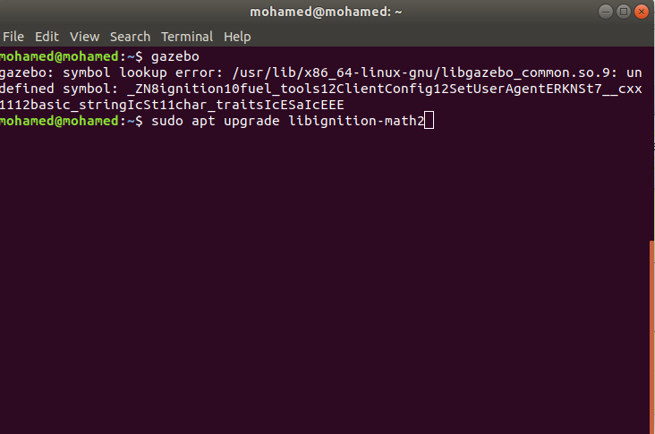

# Install Gazebo

We are using Gazebo 9 which is used with ROS melodic and PX4. For detailed steps see [Gazebo](http://gazebosim.org/tutorials?cat=install&tut=install_ubuntu&ver=9.0)

1. Setup computer to accept software

    sudo sh -c 'echo "deb http://packages.osrfoundation.org/gazebo/ubuntu-stable `lsb_release -cs` main" > /etc/apt/sources.list.d/gazebo-stable.list'

to check if process is done correctly

    cat /etc/apt/sources.list.d/gazebo-stable.list

2. Setup Key

    wget https://packages.osrfoundation.org/gazebo.key -O - | sudo apt-key add -

3. Check if there is required updates

    sudo apt-get update

4. Install Gazebo

    sudo apt-get install gazebo9 libgazebo9-dev

5. To make sure it is installed correctly write

    gazebo

if this error appears

Use this command to update package

    sudo apt upgrade libignition-math2

Then run `gazebo` command again and it will open gazebo simulator.

