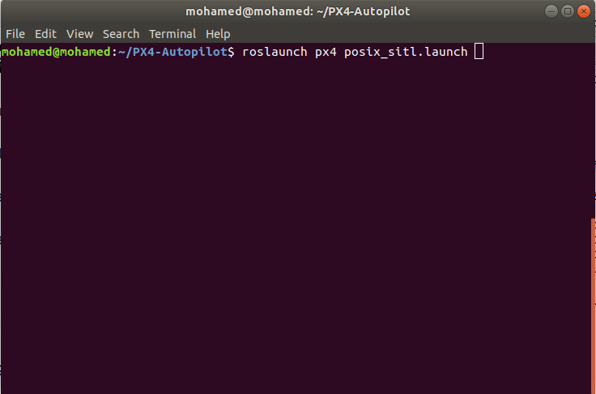
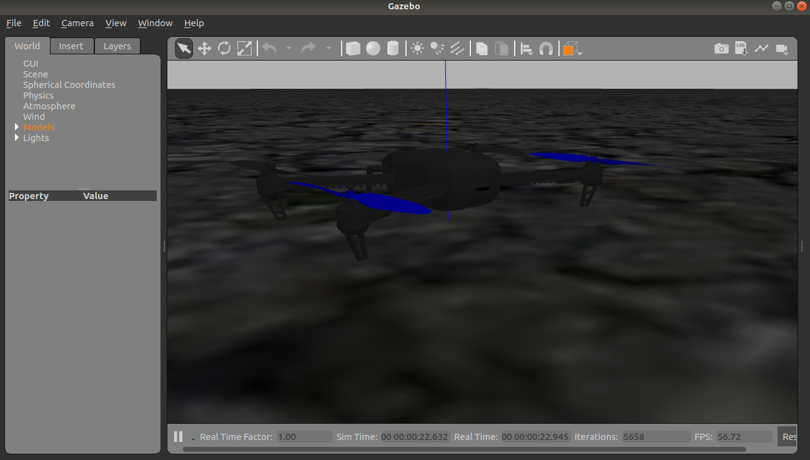
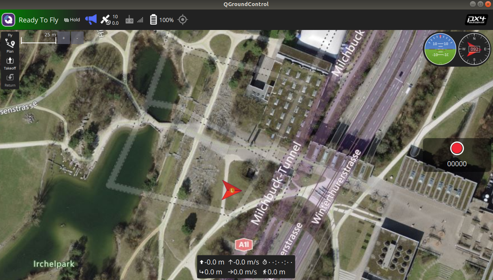
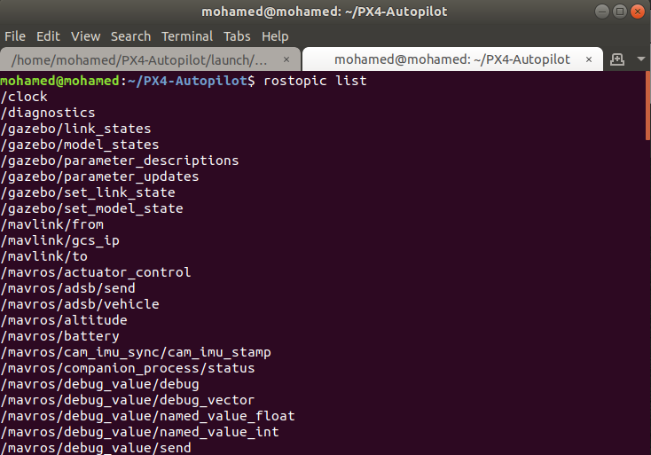
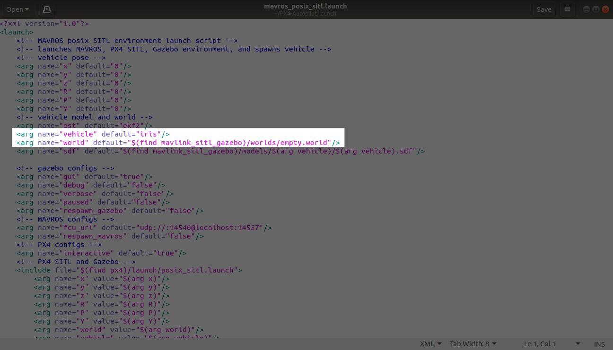
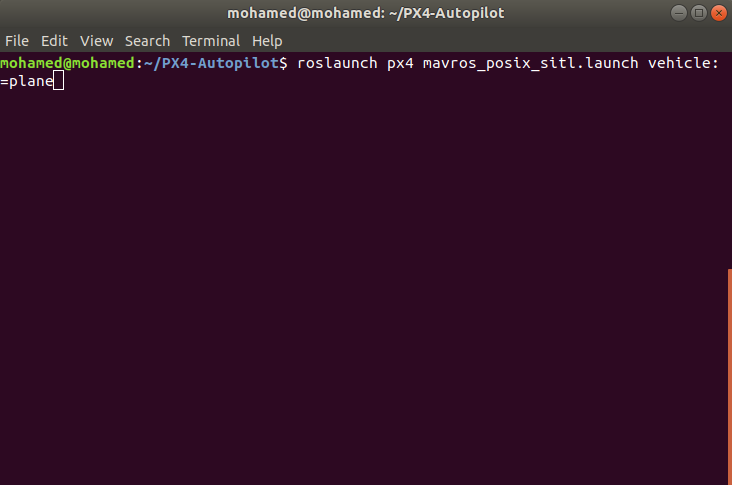
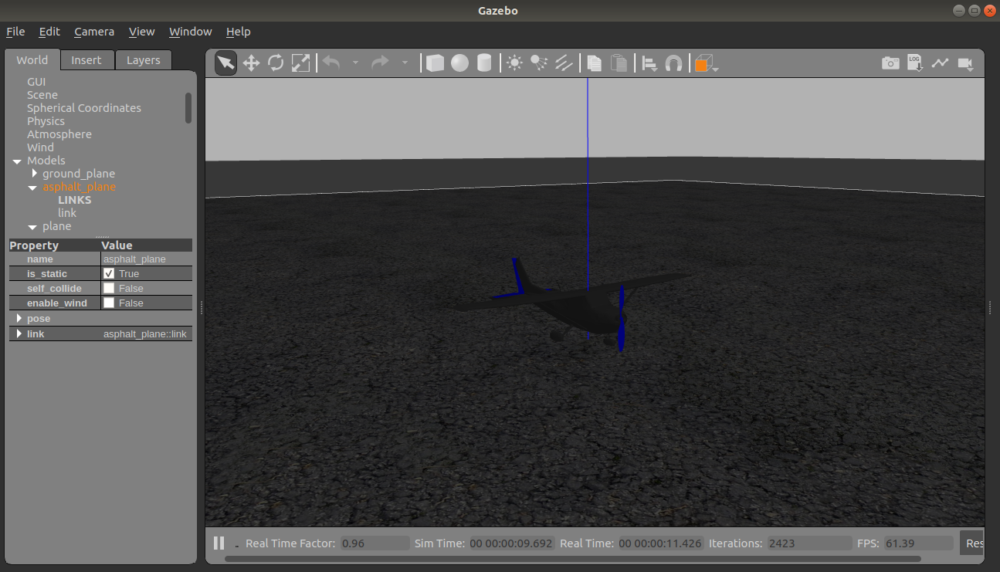
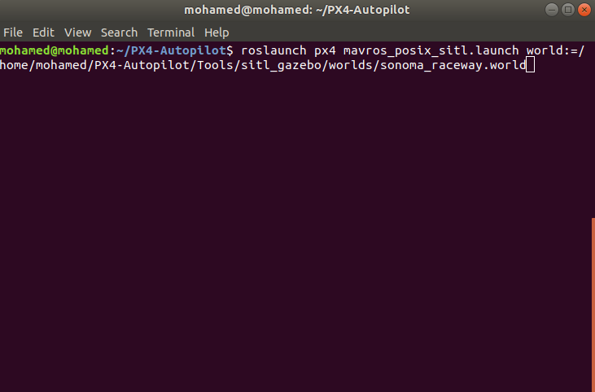

# Run PX4 with gazebo & ROS

Before you run PX4 with Gazebo and ROS you need first to install [PX4](Install.md), [Gazebo](../Gazebo/Install.md) and [ROS](../ROS/Install.md).

[PX4](https://docs.px4.io/master/en/simulation/ros_interface.html) mentioned how to run PX4 with Gazebo and ROS. First you need to run some commands in terminal.

    cd PX4-Autopilot
    DONT_RUN=1 make px4_sitl_default gazebo
    source ~/catkin_ws/devel/setup.bash    # (optional)
    source Tools/setup_gazebo.bash $(pwd) $(pwd)/build/px4_sitl_default
    export ROS_PACKAGE_PATH=$ROS_PACKAGE_PATH:$(pwd)
    export ROS_PACKAGE_PATH=$ROS_PACKAGE_PATH:$(pwd)/Tools/sitl_gazebo

These lines setup PX4 directory as ROS package so you can run nodes and launch files in it. Or instead of writing all these lines one at a time, you can write a script that contains these lines and just run this [script](../src/bash/setup_ros_pack.bash). First you need to copy it to `PX4-Autopilot`. Then you need to allow executing this script. Right click on script then select **Properties**

From **Permission** tab select **Allow executing file as program**

Now, you can run this script by using.

    cd PX4-Autopilot
    source setup_ros_pack.bash

For first time running these commands it will take some time because building process, but next times you run it, it will not take too much time. This could give some error because of missing python packages. Now you can run Gazebo simulator using:

    roslaunch px4 posix_sitl.launch

which will run gazebo simulator with quad-rotor, to close this process you can end task by using `ctrl+c` in terminal.

The easiest way to control vehicle is to use [QGroundControl](https://docs.qgroundcontrol.com/master/en/getting_started/download_and_install.html#ubuntu) software. When you run Gazebo simulation open QGroundControl and it will connect automatically to vehicle in Gazebo. (Before running QGroundControl allow execution of this software).

You can use QGroundControl as using it with real vehicles. To run it while using mavros to publish topics over ROS, use this launch file instead.

    roslaunch px4 mavros_posix_sitl.launch

To run SITL with different vehicles and different worlds, you can change default values for arguments.

This is done by passing additional argument for launch command.

    roslaunch px4 mavros_posix_sitl.launch vehicle:=<vehicle_name> world:=<world_name>

