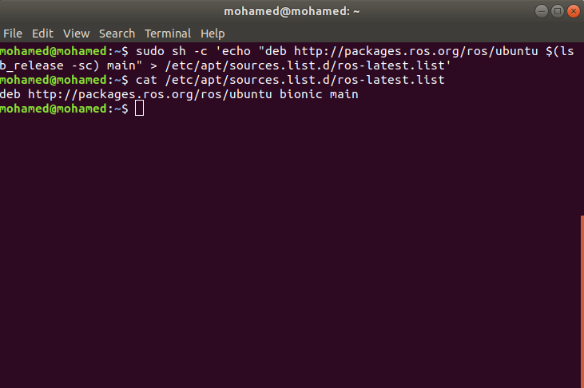
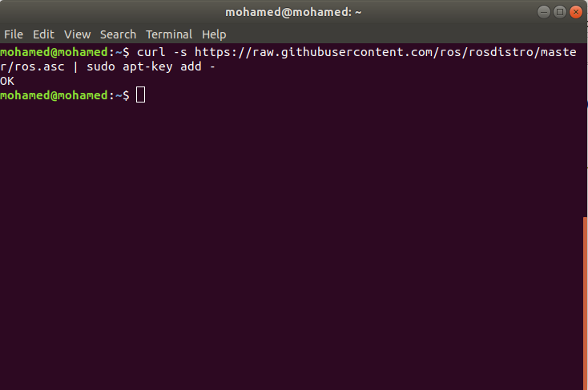
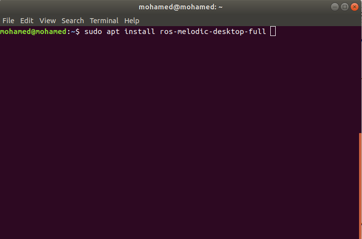
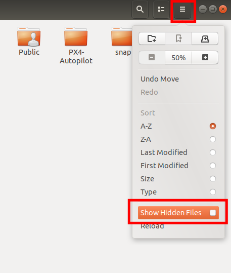
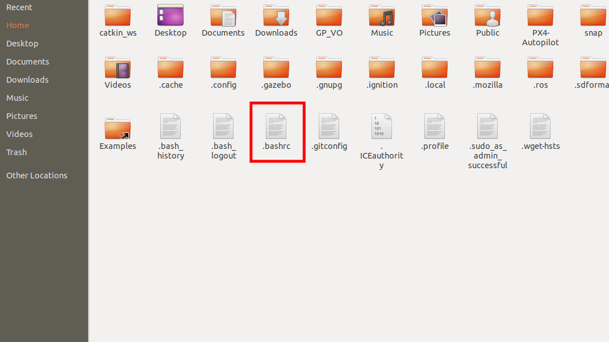
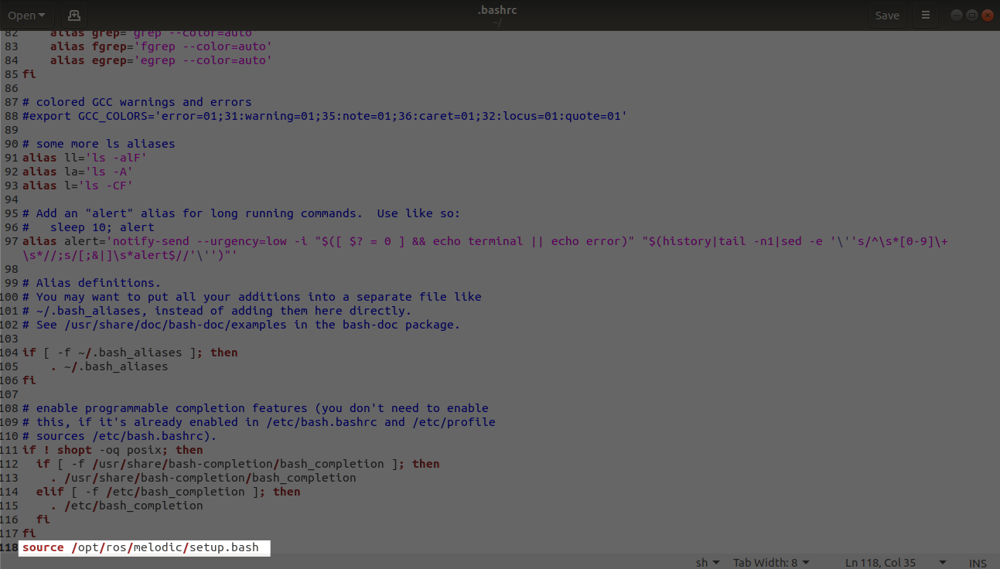

# Install ROS melodic

For more details [ROS](http://wiki.ros.org/melodic/Installation/Ubuntu)

1. Setup computer to accept software

        sudo sh -c 'echo "deb http://packages.ros.org/ros/ubuntu $(lsb_release -sc) main" > /etc/apt/sources.list.d/ros-latest.list'

to check if process done correctly

        cat /etc/apt/sources.list.d/ros-latest.list

2. Setup key

make sure you have curl

        sudo apt install curl

setup key

        curl -s https://raw.githubusercontent.com/ros/rosdistro/master/ros.asc | sudo apt-key add -

3. Make sure all packages are up to date

        sudo apt update

4. Install ROS

        sudo apt install ros-melodic-desktop-full

5. Setup environment by copy this command into `.bashrc` file, so this setup file is loaded when terminal window is opened.

        source /opt/ros/melodic/setup.bash

To open `.bashrc` file first you need to show hidden folders.

Then you will find `.bashrc` file at home directory

add this line at the end of file.

